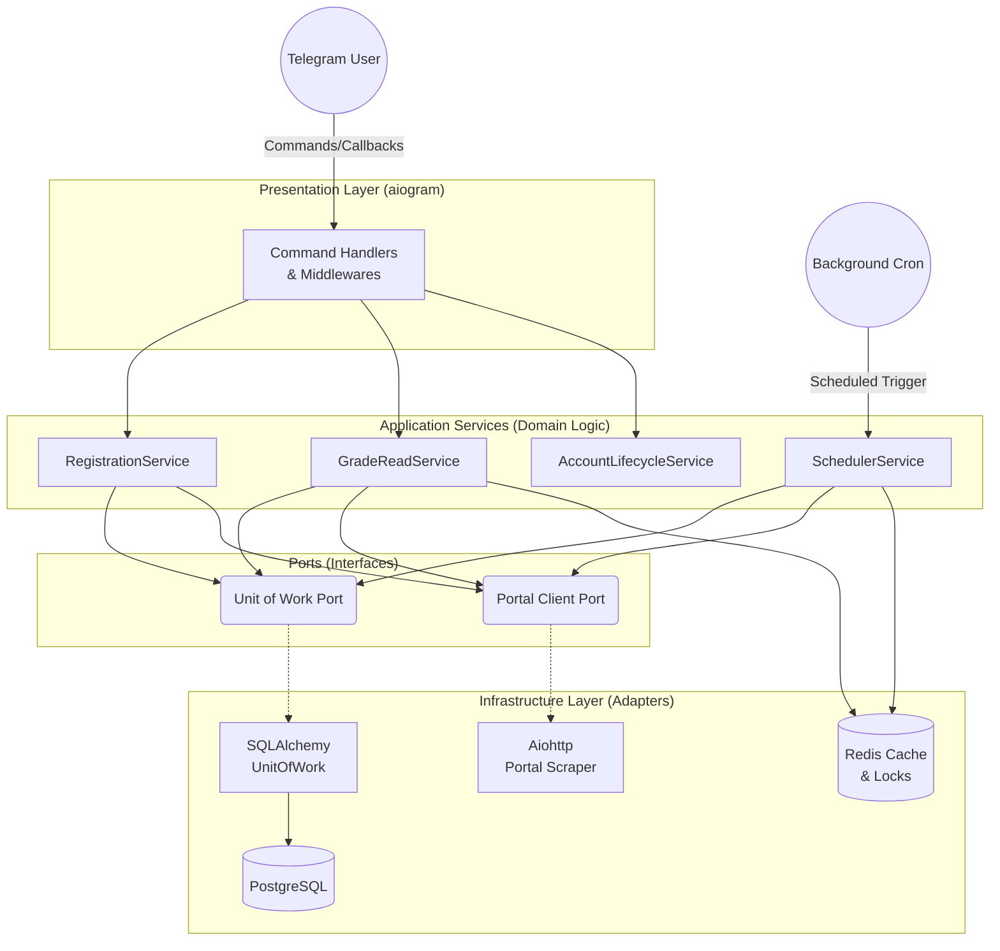
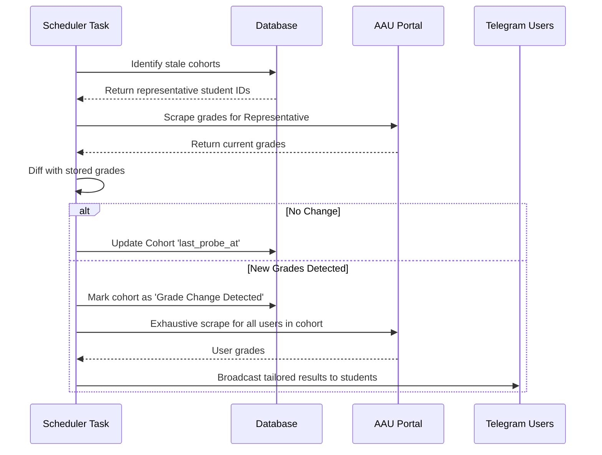
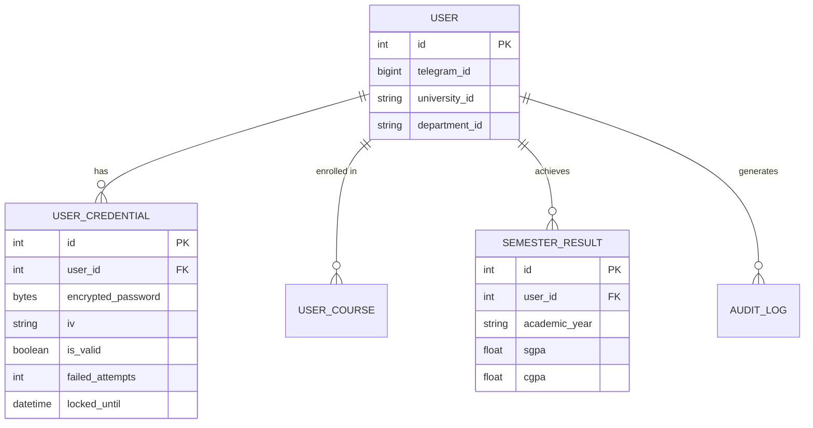

# AAU Grade Bot

AAU Grade Bot is a Telegram-based grade tracker for AAU students. It logs in to the AAU portal, stores encrypted credentials and academic data, watches for grade changes, and notifies users and administrators through a small set of well-defined handlers and services.

The repository is organized as a layered application:

- [`handlers/`](../src/handlers) translate Telegram and HTTP inputs into service calls.
- [`services/`](../src/services) orchestrate registration, grade reads, scheduler runs, admin actions, and account lifecycle work.
- [`repositories/`](../src/repositories) define persistence contracts and SQLAlchemy implementations.
- [`clients/`](../src/clients) hold portal and Telegram adapters.
- [`parser/`](../src/parser) contains safe HTML parsing for AAU pages.
- [`crypto/`](../src/crypto) encrypts sensitive data at rest.
- [`docs/`](./) explains how the system works, why it is shaped that way, and how to run it.

## 🚀 Key Features

- **Automated Grade Fetching**: Runs intelligent, cohort-based cron scans in the background to detect new grades without DDOSing the university portal.
- **Instant Telegram Notifications**: Tailored, rich messages sent to users the exact moment their grades are published.
- **Military-Grade Security**: Portal passwords are encrypted at rest using AES-256-GCM. The bot never stores plaintext passwords (ADR-001).
- **Anti-Lockout Protection**: Automatically pauses automated scraping if a password expires or changes, protecting university accounts from being locked out due to invalid attempts (ADR-021).
- **Atomic Concurrency**: Distributed locks and semaphores using Redis ensure cron jobs don't overlap and outward HTTP connections are strictly limited (ADR-019).
- **Customizable FSM**: Change your department, section, or password on the fly with a simple inline keyboard menu backed by Redis FSM state.

## 🏗️ Architecture Diagrams

### Strict Layering (Ports and Adapters)

The project is structured using Domain-Driven Design and Hexagonal Architecture principles. Changes to the Telegram API do not affect business logic, and changes to the database do not break the portal scrapers.



### Cohort Scanning Sequence

To prevent overloading the university portal, the scheduler groups students into cohorts and scrapes grades for **one representative student** per cohort. Only if new grades are detected does it fan out.



### Core Database Entities



## Quick start

1. Create and activate a virtual environment.
2. Install dependencies from `requirements.txt`.
3. Set `BOT_TOKEN`, `DATABASE_URL`, `ENCRYPTION_KEY`, `CRON_SECRET`, and `METRICS_SECRET`.
4. Apply database migrations.
5. Start the app with `python main.py`.

Example commands are documented in [Setup](./setup.md).

## Run checks

Run the full test suite with:

```bash
python -m pytest tests/ -q
```

## Documentation map

This documentation is the implementation contract. Start with the architecture docs, then use the linked pages for feature behaviour and constraints.

| Document | Purpose |
| --- | --- |
| [Architecture overview](./architecture/overview.md) | Boundaries, dependency rules, composition root, and key flows. |
| [Application map](./architecture/application-map.md) | Handlers, services, repositories, and external ports to build. |
| [Use cases](./architecture/use-cases.md) | User-visible and operational behaviour. |
| [Data model](./architecture/data_model.md) | Current PostgreSQL schema and invariants. |
| [Testing strategy](./testing-strategy.md) | Unit, integration, contract, and stress testing strategy. |
| [Setup guide](./setup.md) | Complete guide for installation, environment configuration, database setup, and execution commands. |
| [Operations](./operations.md) | Cron authentication, concurrency limits, metrics, lifecycle, and runbook. |
| [Portal contract](./portal-contract.md) | Sanitised AAU evidence required for the portal adapter. |
| [Connection pooling](./concepts/connection-pooling.md) | Neon pooler, PgBouncer transaction mode, and NullPool configuration. |
| [Concepts](./concepts/README.md) | Practical explanations of `aiogram`, SQLAlchemy async, Redis, encryption, and connection pooling. |
| [ADRs](./architecture/decisions/README.md) | Permanent records of architectural decisions. |
| [Contributing](./contributing.md) | Rules for safe, modular changes. |

## Recommended reading order

1. [Architecture overview](./architecture/overview.md)
2. [Application map](./architecture/application-map.md)
3. [Use cases](./architecture/use-cases.md)
4. [Portal contract](./portal-contract.md)
5. [Concepts](./concepts/README.md)
6. [Setup](./setup.md)
7. [Testing strategy](./testing-strategy.md)
8. [Operations](./operations.md)
