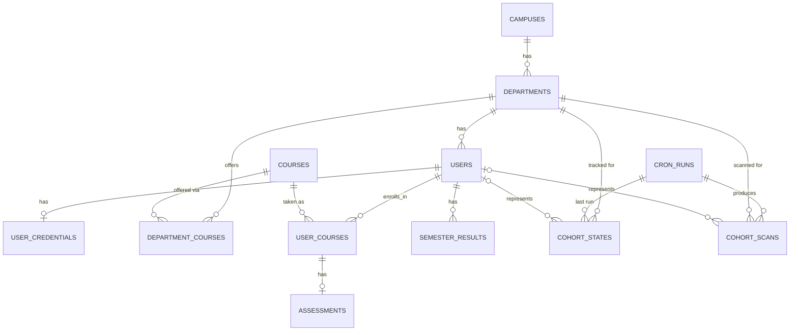
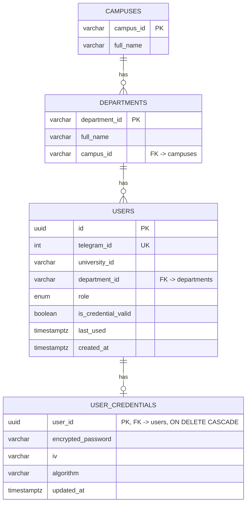
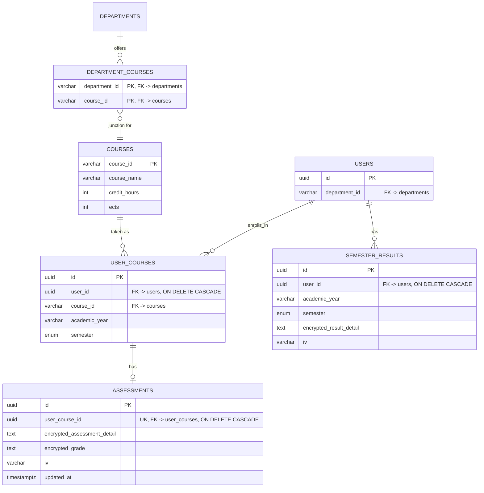
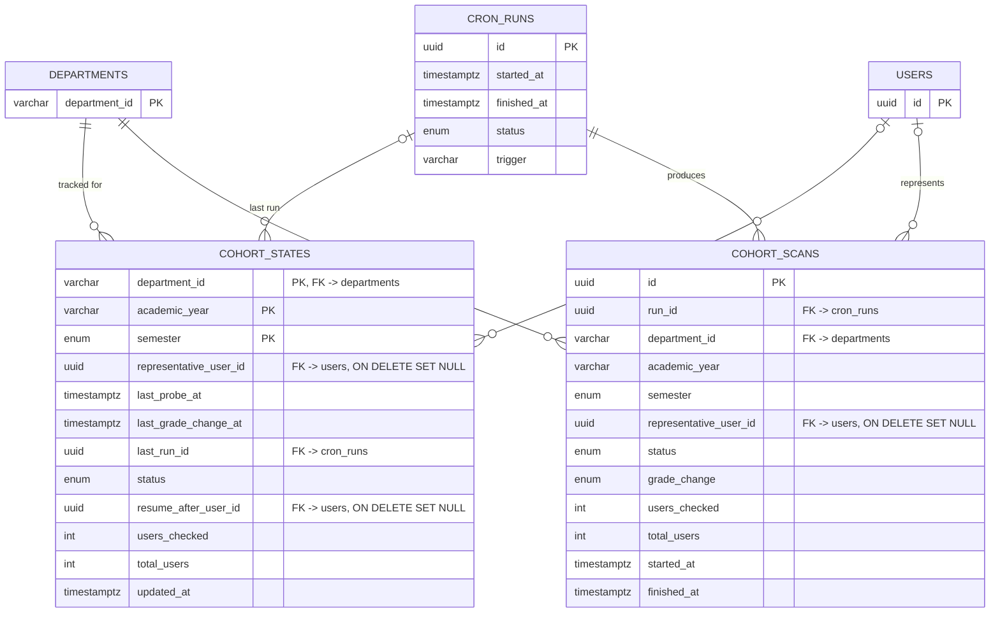

# Data Model

This describes what each table is for, how they relate, and a few things
that aren't obvious from reading the code cold. For *why* a table is shaped
the way it is, see [architecture/decisions](./decisions/README.md)  this
document stays descriptive on purpose, so it doesn't drift out of sync with
reasoning that belongs elsewhere.

**Live, browsable schema:** [dbdiagram.io/d/6a4be02a4ac62e474c40010f](https://dbdiagram.io/d/6a4be02a4ac62e474c40010f)
 every column, type, and constraint, kept in sync with `models.py`. The
diagrams below are grouped by domain and trimmed to what matters for
understanding *relationships*, not a full column reference  use dbdiagram
for that.

---

## Schema at a glance

`AuditLog` and `SystemSetting` aren't in this diagram  they're deliberately
standalone, and that omission is itself meaningful (see their sections
below).

Four domains, expanded one at a time below:

1. **Reference & Identity**  who a user is, and the campus/department
   structure they belong to.
2. **Academic Records**  courses, enrollments, grades, results.
3. **Scanning & Scheduling**  the canary sampling machinery.
4. **Cross-cutting**  audit trail and runtime settings, both intentionally
   decoupled from everything else.

---

## 1. Reference & Identity

**`campuses`, `departments`**  AAU's campus and department structure.
Small, stable, seeded by hand once. `department_id` is a natural key (e.g.
`SITE`), not a generated UUID  these codes are how AAU itself refers to
departments, so there's no benefit to hiding them behind a surrogate key.

**`users`**  one row per Telegram user registered with the bot. Holds
identity (`telegram_id`, `university_id`), role, and department. Does *not*
hold login credentials.

**`user_credentials`**  one-to-one with `users`, holds the encrypted
university password used to scrape grades. Split into its own table
deliberately, so credential access is a conscious, visible step in the code
rather than something that comes bundled with every ordinary `User` lookup.
See [ADR 002](./decisions/002-user-credential-isolation.md).

---

## 2. Academic Records

**`courses`, `department_courses`**  the course catalog and which
departments offer which courses (many-to-many, via the `department_courses`
junction table). Unlike campuses/departments, this is *not* seeded upfront
 rows appear the first time a scraped student is found taking that course.
`course_id` (e.g. `SECT-3082`) is permanent and identifies the same
real-world course across academic years.

**`user_courses`**  one row per (user, course, academic year, semester)
combination. A student can retake the same course code in a different term,
so all four fields together form the natural key
(`uq_user_course_term`)  that's why this table needs a composite unique
constraint rather than treating `(user_id, course_id)` alone as unique.

**`assessments`**  one-to-one with `user_courses`, holding the encrypted
grade detail for that specific enrollment.

**`semester_results`**  one row per (user, academic year, semester),
holding the aggregated result for that term  separate from, and not
derived automatically from, individual course grades in `assessments`.

All grade-bearing fields (`encrypted_grade`, `encrypted_assessment_detail`,
`encrypted_result_detail`) are AES-256-GCM encrypted at rest. See
[ADR 001](./decisions/001-encrypt-grades-then-gcm.md).

---

## 3. Scanning & Scheduling

**`cron_runs`**  one row per scheduled or manually-triggered scrape cycle.
The parent record everything in a given run hangs off of.

**`cohort_states`**  one row per cohort (`department_id` + `academic_year` + `semester`), holding the *current* canary-sampling state: who the
representative user is right now, whether resumable scanning is mid-way
through the cohort, and when a grade change was last observed. This table
is small and fixed-size  one row per cohort, forever, updated in place.

**`cohort_scans`**  append-only log of every scan attempt for every
cohort, linked back to the `cron_runs` that produced it. Never updated
after insert; this is the table that grows without bound over time.

`cohort_states` and `cohort_scans` are two tables instead of one
specifically because "what's true right now" and "what happened in each
past attempt" are different shapes of data with different lifecycles  see
[ADR 003](./decisions/003-cohort-state-vs-scan-split.md). The
`UNIQUE(run_id, department_id, academic_year, semester)` constraint on
`cohort_scans` isn't just deduplication  it's the idempotency guarantee
that stops a retried job from producing two log rows for the same scan.

---

## 4. Cross-cutting

**`audit_logs`**  security- and debugging-relevant events, keyed by
`telegram_id` with **no foreign key to `users`**. This is deliberate, not
an oversight: an audit trail needs to survive the account it describes
being deleted (self-destruct, admin removal, inactivity purge). A `CASCADE`
would erase the record exactly when it might matter most; a `RESTRICT`
would block user deletion until logs are cleaned up separately. Neither is
acceptable, so the relationship is left as a plain indexed column instead of
a real FK. See [ADR 005](./decisions/005-audit-log-no-user-fk.md).

**`system_settings`**  admin-configurable runtime flags
(`is_scheduling_enabled`, `is_maintenance_mode`, etc.), stored as a plain
key/value table. Standalone by nature  it doesn't describe an entity, it
configures the system that manages all the others.

---

## Constraints and gotchas

A few things about this schema that aren't obvious from reading the code
cold, worth knowing before you touch it:

- **Enum columns store the Python member *name*, not `.value`.** `Semester`,
  `UserRole`, and the other status enums are plain `Enum` classes (no string
  values assigned); SQLAlchemy's `Enum` type persists the member name
  (`"FIRST"`, `"RUNNING"`) as a native Postgres `ENUM` type. This is
  intentional  don't "fix" it by adding string values back.
- **All timestamps are `timezone=True`.** No column uses the bare
  `Mapped[datetime]` shorthand, which defaults to a naive column. See
  [ADR 004](./decisions/004-timezone-aware-timestamps.md) for the bug this
  fixed and why it mattered.
- **`user_courses` and `semester_results` don't have a separate index on
  `user_id`.** Their composite `UniqueConstraint` already creates a btree
  index with `user_id` as the leading column, which covers "all courses/
  results for this user" queries via leftmost-prefix matching  a second,
  separate index would be redundant.
- **DB-level `ondelete` cascades exist *in addition to* ORM-level
  `cascade="all, delete-orphan"`, not instead of it.** The ORM cascade only
  fires when SQLAlchemy loads and deletes objects through a session; a raw
  `DELETE` (bulk cleanup script, manual `psql` session, admin tooling that
  bypasses the ORM) only respects the DB-level `ondelete` clause on the
  foreign key itself. Both are needed for the guarantee to hold regardless
  of how a delete happens  verified by actually deleting a user with an
  attached course and assessment and confirming the cascade completes at
  the raw SQL level, not just through the ORM.
- **`uq_scan_per_run_cohort` on `cohort_scans` is an idempotency guard, not
  just deduplication.** Treat it as load-bearing for correctness, not a
  nice-to-have  it's what makes a retried cron job safe to re-run.