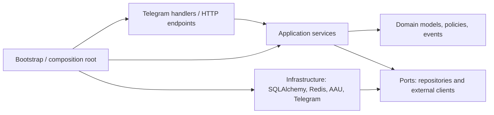
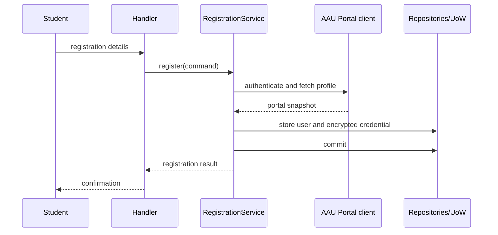
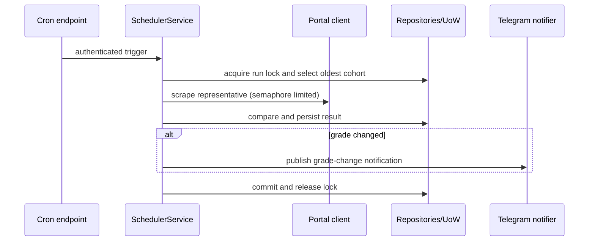

# Architecture overview

AAU Grade Bot notifies registered students when grades change and lets them view their most recently stored grades in Telegram. AAU is the first portal; the application depends on a university-neutral portal contract so another university can be added without changing domain or application services.

## Dependency rule

Dependencies point inward. Domain code imports no Telegram, SQLAlchemy, Redis, HTTP, or asyncio framework types. Application services orchestrate a use case; repositories return domain models/DTOs, never ORM instances. Infrastructure implements ports. `bootstrap.py` is the only place that constructs concrete implementations and injects them.

## Runtime boundaries

- A Telegram update or HTTP request receives a correlation ID, is rate-limited, and opens one Unit of Work only for its own work.
- Event handlers are supervised by the dispatcher. Business services do not call `asyncio.create_task` directly.
- A Unit of Work owns one `AsyncSession`; it explicitly commits or rolls back and is never shared across concurrent tasks.
- Each scrape performs a fresh AAU login, fetches home and grades pages, and returns parsed DTOs plus warnings or a typed failure.

## Key flows

See the [application map](./application-map.md), [use cases](./use-cases.md), and ADRs for the detailed contract.
